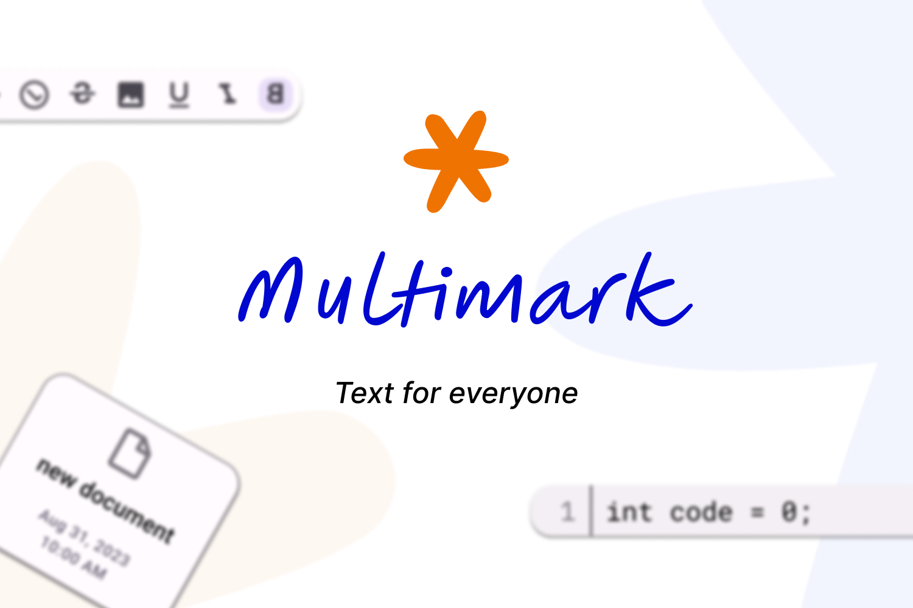

# Multimark

**Multimark** — особенный редактор Markdown, находящийся в разработке. Он предлагает полную поддержку различных
тегов из CommonMark, а также расширения от GitHub и других сервисов. При этом он не ограничивается
только ими, вы сможете добавить собственные теги и реализации с помощью встроенной конфигурации.

Редактор пишется с помощью `Compose Multiplatform + Kotlin`. Это позволяет использовать один и тот
же код для разнообразных платформ, сейчас он разрабатывается в первую очередь как настольное
приложение.

Скрафчен с :heart: в `Leftbrained`!

[comment]: <> (Необходимо обновлять по степени изменения во время разработки)

## Структура проекта

> Обновляется по мере разработки

```mermaid
graph TD
    subgraph startup["Native Startup"]
        subgraph desktopApp["demos/desktop_test"]
        fileA("build.gradle.kts")
        fileB("main.kt")
        fileA --> fileB
        end
    end

    subgraph Shared
        subgraph common["commonMain"]
        folderD("core")
        folderE("ui")
        folderF("resources")
        folderG("models")
        dsl("DSL + Configuration")
        folderD --> dsl
        folderE --> dsl
        folderF --> dsl
        folderG --> dsl
        end

        subgraph desktop["desktopMain"]
            mainDesktop("main.desktop.kts")
        end
        desktop -->|Native functions| common 
    end

    Shared --> startup
```

## Дорожная карта

## Контрибьютинг

Последовательность действий и правила представлены в [CONTRIBUTING](CONTRIBUTING.md)

## User Flow

```mermaid
graph TD
  A[Начало] --> B[Открытие редактора Markdown]
  B --> C[Создание нового файла]
  B --> D[Открытие существующего файла]
  C --> E[Редактирование файла]
  E --> F[Сохранение файла]
  F --> G[Выбор действия]
  G --> E
  G --> H[Закрытие редактора Markdown]
  D --> E
  E --> F
  G --> I[Открытие главного меню]
  I --> J[Открытие настроек]
  J --> K[Изменение настроек]
  K --> J
  J --> I
  E --> L[Открытие меню документа]
  L --> M[Открытие настроек]
  M --> N[Изменение настроек]
  N --> M
  M --> L
```
